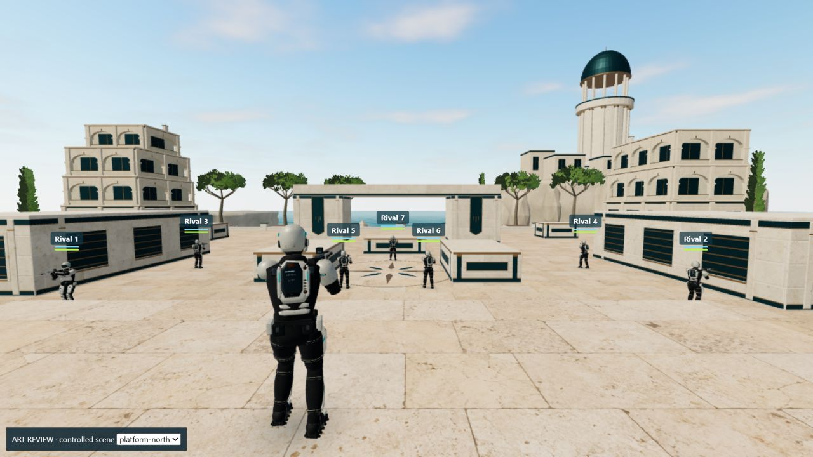

# Coastal galleries

The coastal architecture replaces shallow exterior window boxes with structural stone arches, broad connected piers, 0.8 m upper galleries and half-metre floor setbacks. Closed lower shutters distinguish scenery from playable routes. Two lower wings sit farther south on masonry sea walls; their detailed returns face north into the arena.

The main north approach and selected spawn views gain more legible architectural depth. The side approaches expose more coastline after the lower wings move. The south-facing platform view remains open water; this is a change to selected compositions, not an improvement in every direction. The scenery remains simpler than the illustrated concept.

The environment is 6,620,096 bytes, 68,670 triangles and 123,713 exported vertices in the existing 15 batches. Compared with V3 this saves 78,636 bytes, 814 triangles and 2,048 vertices. Its SHA-256 is `43ff13d3f2d8376bf03e1a2a84c94e6b0804bfe8998c31f4a304c0d993e64f9b`; the versioned URL is `/models/environment.glb?v=sunbreak-coastal-v1`.

Only the three exterior-building batches change. The playable arena and trim, foliage, cliffs, horizon, embedded images/materials, Scout, map, movement, loadout and match rules remain unchanged. The source uses the same random sequence and textures. The existing 70,000-triangle, 140,000-vertex, 7 MB and 15-batch ceilings remain in force.

The [export report](../art/source/environment-export-review.json) checks all 17 collision references, 102 visible solid faces, four clear routes and four floor joins. The 4,096 m² paving remains the only upward floor layer. Additional building-only rays check gallery backs, piers, the curved intrados and both southern foundation joints; depth assertions prevent a flat facade from satisfying the gallery checks. A 2 cm foundation gap found during review was closed before acceptance.

Rendered comparison uses the actual GameView in an explicitly controlled art fixture with eight Scouts, twelve camera placements and an identical Low pixel budget. Those images assess composition; they are separate from actual input, multiplayer and physical-phone acceptance. The release record identifies shipped revisions and their verification.

The [independent comparison](verification/coastal-gallery-comparison.json) passes 17 preservation and 149 geometry checks. Twelve protected batches have exact accessor values and ordering. The [negative controls](verification/coastal-gallery-validator-controls.json) separately restore each previously found foundation gap and require its corresponding assertion to fail.

The [rendering record](verification/coastal-gallery-render.json) includes all twelve image pairs, a separate 852×393 Low-quality canvas capture and equal-resolution A/B/A samples. Seven rivals move while the local Scout stays at the fixed camera. At the same 1182×665 drawing buffer, baseline medians were 16 and 17.5 FPS around the candidate's 18 FPS. The test used Microsoft Basic Render Driver software rendering, so it supports no measured regression in this bounded scene, not a hardware-GPU or phone frame-rate claim. These numbers are not comparable to the historical AMD GPU runs.

All [155 tests, asset validation, TypeScript and the production build](verification/coastal-gallery-local.json) pass. The [production-build practice](verification/coastal-gallery-gameplay.json) exercised native touch-emulated Ready, the countdown, AR fire, player respawns, first-to-15 results and return to the menu in an isolated local database. The two expected versioned model requests each appeared once in browser resource timing at the matching file size. Observed network windows were truncated; event totals describe those samples only. There were no application console errors.

The in-app browser refused desktop mouse capture in both hidden and visible attempts, so this run does not verify desktop engagement. The existing retry and readiness timeout behaved correctly; no capture permission or input implementation changed. Physical-phone controls/rendering and a match between households remain unverified. Architecture remains an original stylized art pass, not demonstrated Fortnite-level quality.

