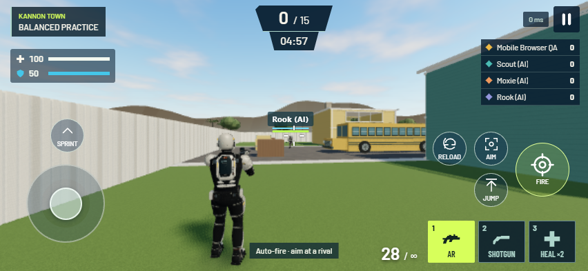

# Kannon Town

The [September 9 graphics release](TOWN_GRAPHICS.md) supersedes the asset counts and visual baseline below. The layout, collision and gameplay described here remain unchanged. and mobile controls

Kannon's first playtest exposed movement that could remain held after an iPhone finger ended. Separate Fire and aiming gestures were also difficult. This release replaces touch ownership, adds Simple and Advanced firing, and makes Kannon Town the only playable map.

## Phone controls

The left side moves and the right side aims. **Simple**, the default, fires after the crosshair rests on a visible rival for 100 ms and stops when it leaves. Walls, muzzle obstruction, spawn protection, reload/heal, death, menus and stale snapshots disable assistance. It submits ordinary inputs; unchanged server combat decides cadence, ammo, damage and hits. Healing always requires slot 3 and a deliberate tap.

**Advanced** allows holding and dragging Fire to aim with that thumb. AR aims in; shotgun hip-fires. If a separate aiming finger is down, it owns camera rotation. The existing Aim toggle remains available. Optional **Gyroscope aiming** starts off, requests motion permission through its enable button, and has independent sensitivity. It requires a supported secure browser and physical-phone tuning.

This follows Activision's [Call of Duty: Mobile controls guide](https://blog.activision.com/call-of-duty/2019-10/Getting-a-Grip-on-the-Call-of-Duty-Mobile-Controls), using original UI and input code.

`TouchGestures` owns native touch identifiers and reconciles the document's complete live-contact list. It does not rely on the joystick receiving pointer release. Each finger releases its own action and stationary holds never expire on a timer. Cancellation, backgrounding, orientation changes, menus, death and mode changes clear held actions. Pointer-only devices retain document/capture fallbacks. [TouchEvent.touches](https://developer.mozilla.org/en-US/docs/Web/API/TouchEvent/touches) and [motion permission](https://developer.mozilla.org/en-US/docs/Web/API/DeviceMotionEvent/requestPermission_static) document these browser primitives.

## One neighborhood map

The requested Nuketown arrangement informs two opposing two-story homes, garages, upstairs sightlines, rear balconies/yards and central yellow-bus/open-truck cover. Activision's [Nuketown map guide](https://www.callofduty.com/blog/2020/11/Black-Ops-Cold-War-Tactical-Map-Intel-Nuketown-84) supplied the reference. Geometry, materials, colors, props and dimensions are original Kannon Blender work; no extracted game assets are included.

Both homes have playable ground and upper floors. Four stair routes connect the floors/balconies and a fifth access route enters the truck. Eight spawns occupy the rear yards. Shared bounds keep airborne players inside the fence. Sunbreak is retired from gameplay; its historical sources remain. Additional maps are deferred until this one is refined through family matches.

The [concept](art/kannon-town-concept.png) establishes sunny desert light, mid-century houses, asphalt and warm vehicle colors. The actual houses face each other for opposing lanes. Browser geometry has simpler silhouettes and surface density than the concept and retains the existing Scout. The former ocean surface is removed. Blender previews are authoring views; actual GameView captures are runtime evidence.

## Editable assets

Run Blender 5.2 with `--background --python scripts/blender/generate_town.py`, then `npm run test:assets`. Set `KANNON_TOWN_PREVIEW=1` for authoring previews. The generator reads the shared map through `scripts/blender/export_map.ts`, packs original materials and vertex colors, stages a complete valid GLB and replaces the public file atomically. Do not run the historical Sunbreak generator against the current public model.

| Asset | Current value |
| --- | --- |
| Editable scene | `art/source/kannon-town.blend` |
| Runtime | `/models/environment.glb?v=kannon-town-v1` |
| Size | 3,922,392 bytes |
| Geometry | 31,308 triangles; 62,188 vertices |
| Rendering | 13 material batches; 13 embedded images |
| Collision | 150 volumes; 900 rendered faces checked |
| SHA-256 | `10bc88dfbf95e878225f60ed620bae0a8786ef8176f442f1dff15e39d1b62723` |

The [receipt](../art/source/town-export.json) binds the GLB to the map source hash. The [validator](../art/source/town-export-review.json) checks actual triangles on every collision face, open doors/windows and truck entry, finite geometry/normals/UVs/colors, embedded textures, and ceilings of 7 MB, 70,000 triangles and 18 batches. Native physics/navigation tests separately prove usable support and routes. The original Image Gen asphalt and Blender material sources are retained in `art/source/town-materials`.

Scout remains `9b668768f6b47569f31a8f32c606a9a79e465c16cdcbe55b1e1d3ffa9e0108c9`. Its separate CMU motion notice remains intact.

## Acceptance and limits

All 172 automated tests, asset checks, TypeScript and production build pass. Navigation checks cover every spawn to both upstairs floors, all stair/access routes at three speeds and frame intervals, floor holes/walls, safe recovery from padding, upper pursuit, rematch/disconnect and complete bounded practice rounds at all difficulties.

The [browser input record](verification/kannon-town-browser.json) covers native Chromium contacts with pointer release deliberately suppressed, independent move/look release, cancellation, pagehide and Fire dragging. The built game confirms zero authoritative horizontal velocity after release without respawn, and Simple-mode server shots and hits using only native aiming gestures. WebKit on Windows separately passes the DOM touch lifecycle; it is engine coverage, not a physical iPhone test.

The ready-before-countdown flow is retained. `worldVersion: kannon-town-v1` prevents an old collision client starting or sending input into this arena. Refresh both devices after deployment. The service retains its Coastline origin, profiles/crews/results, combat rules and leaderboard calculations.

The [family playtest](FAMILY_PLAYTEST.md) remains necessary for actual iPhone smoothness, gyro direction/feel and two-player feedback. Software rendering does not establish physical GPU performance, wide-area latency, concurrent-room capacity or commercial-game parity. Hit testing still lacks server rewind.

[Desktop and render acceptance](verification/kannon-town-render.json) verifies native mouse capture, movement/release, looking, firing/ADS, slot selection, Escape recapture and explicit leave. Fifteen controlled GameView scenes cover all spawns, house floors, a rear balcony and Low/High street views. Visual review found a blank frame caused by adapting resolution after drawing. Resize now occurs before the next draw; eight observed resize calls produced zero unpainted frames. These captures use Windows Chromium SwiftShader, not a hardware GPU.

