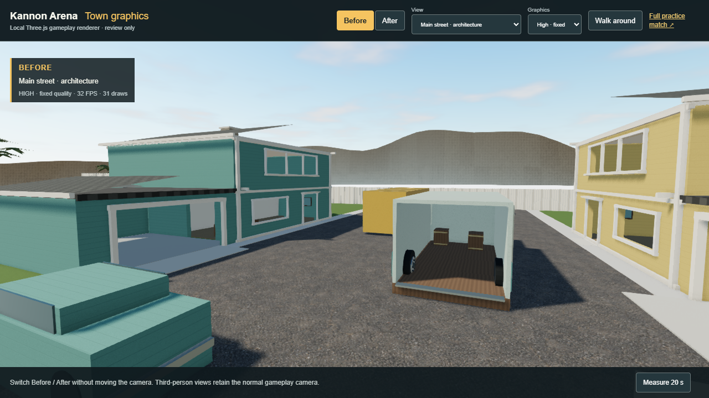
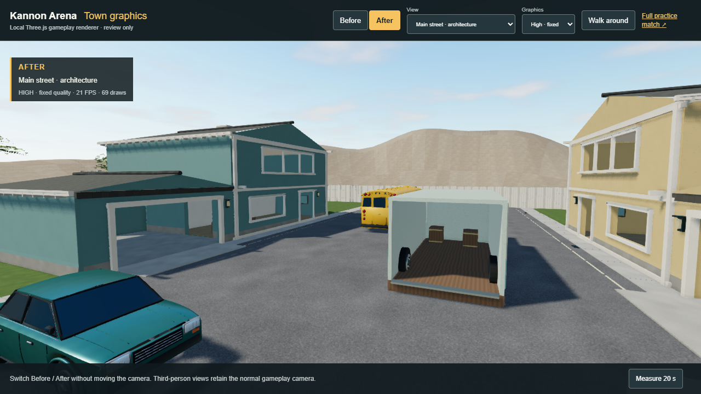
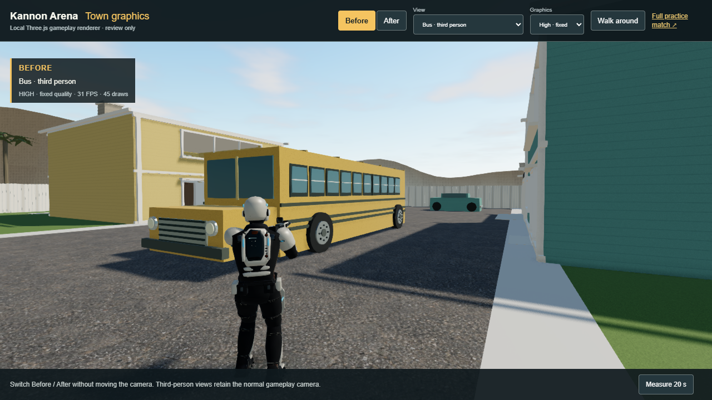
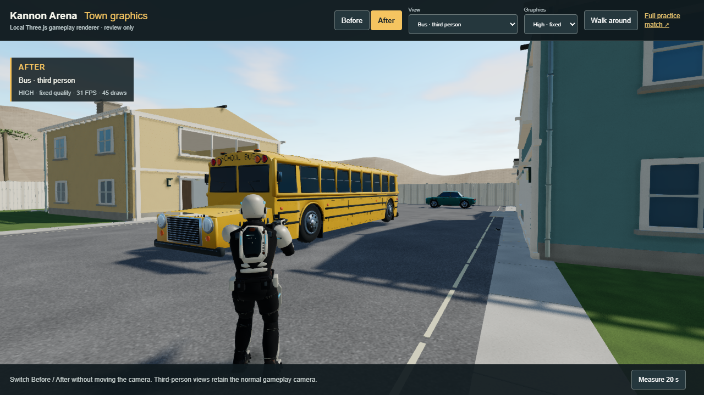
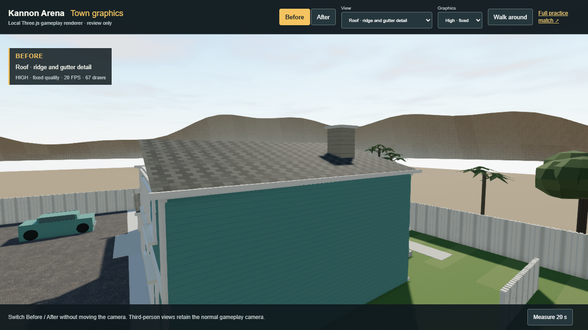
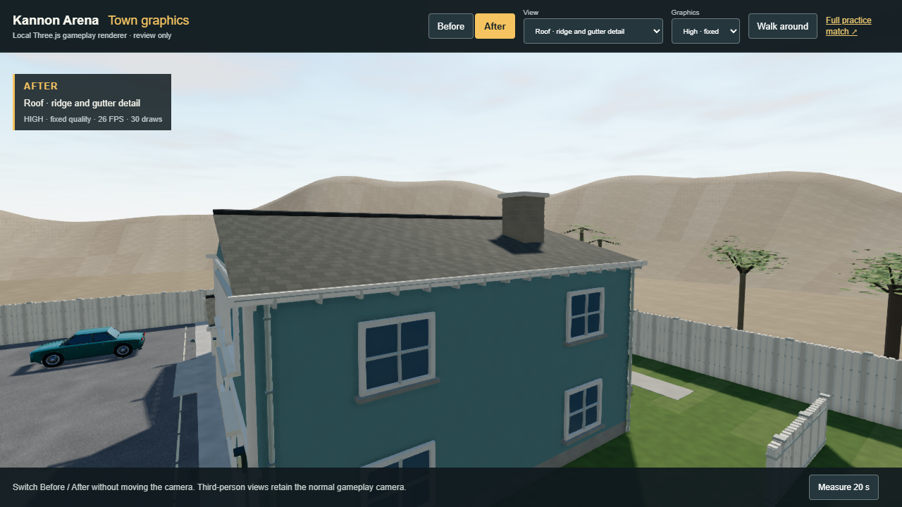

# Kannon Town graphics release — September 9, 2026

The reviewed vehicle experiment is now integrated with a town-wide environment pass. The school bus and two sedans retain their shaped Blender bodies, wheel wells, tires, lamps and separate paint/glass/rubber/metal surfaces. Both houses gain physical siding laps, foundations, roof caps, gutters, downpipes, deeper window trim and closed decorative side windows. Roads, paving, fences, upholstery, planting and distant hills receive new geometry or materials. The inherited inward-facing gables and downward-facing hill strips are corrected.

The town layout, all 150 collision references, four stair routes, open firing windows, doors and garage entrances remain unchanged. The cargo truck retains its geometry and authored material assignments. Scout, cameras, touch controls, weapons, simulation, networking, ranking and storage remain unchanged. The only server change allows the bundled model decoder's WebAssembly under the existing security policy; JavaScript eval and external script origins remain disallowed.

## Play and compare

The normal game uses the refined town. [Play Kannon Arena](https://kpop.8westventures.com). The live `/health` revision and the release pull request identify the exact deployed source.

For the local comparison, run `npm ci` and `npm run graphics-test`, then open **http://127.0.0.1:5184/graphics-test.html**. The separate local server uses port 3014 and `data/graphics-review.sqlite`. If those review servers are already running, use the existing page. The comparison page is development-only and is excluded from the production entry points.

Before/After changes the artwork at identical camera positions, resolution, lighting and graphics settings. Fifteen views cover the street, both houses, roof, rooms, yard, all three vehicles and normal third-person distances. Walk around uses the real renderer, input and shared collision; **Full practice match** opens the actual server-backed practice mode. `?graphics=current` selects the original map in development only. Production always loads the refined town.

## Actual Three.js captures

These are GameView captures, not Blender renders or AI images. Both sides use this release's lighting; they isolate the artwork difference rather than reconstructing the previous production lighting.

| View | Before | After |
| --- | --- | --- |
| Main street |  |  |
| Third-person bus approach |  |  |
| Roof and side facade |  |  |

All 30 matched desktop captures, touch layouts, actual practice captures and raw measurements are retained in the local evidence directory `C:\it\kannon-fps-graphics-evidence`. [Capture metadata](verification/town-graphics-captures.json) records exact cameras, lighting, canvas sizes and requested assets. The normal third-person views include the actual Scout. No new concept images or Blender renders are presented as completion evidence.

## Measured cost

| Model budget | Original production | Refined release |
| --- | ---: | ---: |
| Environment download, bytes | 3,922,392 | 7,884,316 |
| Environment triangles | 31,308 | 155,724 |
| Environment vertices | 62,188 | 239,015 |
| Material primitives | 13 | 33 |
| Embedded images | 13 | 41 |
| Environment + unchanged Scout, bytes | 6,602,156 | 10,564,080 |

The environment adds 3.96 MB; the two gameplay model downloads together grow about 60%. Embedded Meshopt compression reduces transfer size without flattening the vehicle geometry. The final GLB SHA-256 is `321e196339ce46905dc181b7ff50b31ec502426460dd98ed0275285ce454e1bd`; its URL is `/models/environment-refined.glb?v=kannon-town-graphics-v2`. Baseline models are retained for local comparison but are not requested by normal gameplay. The bundled decoder adds code to the existing lazy gameplay chunk; the production build reports a 753 kB minified / 200 kB gzip gameplay chunk and a size warning.

Fixed bus gameplay view, one Scout, Edge 152.0.4191.66, actual AMD Radeon integrated GPU through ANGLE/D3D11. Samples run sequentially for 20 seconds after warm-up, with quality adaptation locked. High includes 2048 shadows and contact shading. Low omits contact shading, with 2048 shadows on desktop and 1024 in the touch layout. The [raw performance report](verification/town-graphics-performance.json) includes GPU timer disjoint checks, frame distributions, draw counts and exact configurations.

| Configuration | Before FPS | After FPS | Before / after median GPU ms | Before / after draws |
| --- | ---: | ---: | ---: | ---: |
| Desktop High, 1280×720 canvas | 36.73; repeat 36.77 | 29.13 | 22.09; repeat 21.12 / 24.61 | 45 / 82 |
| Desktop Low, 1182×665 canvas | 59.94 | 59.94 | 5.66 / 8.41 | 22 / 41 |
| Touch emulation Low, 852×393 canvas | 59.94 | 59.94 | 2.65 / 3.86 | 22 / 41 |

High's 95th-percentile frame time rose from 33.4 to 49.9 ms. Both Low desktop and touch samples stayed at 16.8 ms for the 95th percentile. The additional GPU work remains real even where display refresh caps both results at 60 FPS. These results do not establish eight-player, physical-phone, thermal or battery performance. Both variants are resident in the comparison page, so its memory counts are not production-only memory measurements.

**Mobile means desktop Chromium touch emulation at DPR 1, not a physical iPhone.** Portrait 390×844 and landscape 852×393 layouts were exercised. Physical iPhone Safari performance and gyro feel remain untested in this release.

## Verification and recommendation

All 172 existing rule/client/transport tests, updated security-policy assertion, TypeScript and production build pass. Asset validation decodes the final compressed export, checks finite attributes and budgets, and proves that all 78,580 approved vehicle triangles survive batching unchanged within 30 micrometres. The original vehicle validator checks every complete triangle against its collision-box union. The final export also preserves 1,912 truck triangles with their material names, 150 collision references, 864 nonvehicle rendered collision faces, eight house openings and the truck entrance. See [the export validation](../art/source/town-graphics-validation.json).

Native desktop and touch practice verify deliberate readiness, countdown, actual authoritative movement/release, aiming/firing, layouts and leaving the match. Production acceptance uses the built client and its real security headers, separate from the Vite comparison. The pre-release security check found the compressed decoder blocked by CSP; the scoped WebAssembly permission fixes that specific production failure. The initial touch automation chose a point covered by another control; the final check selects an unobstructed native look target and allows frames between events. These findings are retained in the external evidence rather than hidden as successful runs.

Keep Three.js for the current game and use Automatic or Low on limited GPUs. The town is more consistent with the reviewed vehicles, but it remains game art with simple interiors and approximate shared reflections. A single 128-pixel street reflection is baked once when the world loads; it does not track moving players or supply physically accurate reflections at every vehicle. High quality has a measurable cost on this integrated GPU. Physical iPhone testing and distance-based detail reduction should precede another large increase in art density. This pass does not establish Three.js's maximum visual quality or a need to switch engines.

## Editable sources and provenance

Use Blender **5.2.1 LTS** and Node.js 24+ from the repository root:

```powershell
node scripts/blender/split_vehicle_baseline.mjs --check
blender --background --python scripts/blender/generate_town_graphics.py
npm run test:assets
```

The generator reads the current shared map, imports the byte-verified common town and reviewed vehicle export, saves editable `art/source/kannon-town-graphics.blend`, then stages and atomically replaces the runtime GLB. `art/source/town-graphics-materials/` retains the procedural albedo, normal and roughness/metalness maps; the Blender file also packs them. Export-only grouping merges materials while keeping the editable source objects. Two consecutive runs produced the identical runtime GLB digest above. The script overrides Blender's Meshopt exponent precision inside its own process to preserve small body-panel offsets; it does not edit the installed Blender application.

New town geometry and seeded textures are original procedural work authored for this repository. Vehicle geometry and maps are also original project work; their editable source and generator are retained under `art/source/vehicle-test.blend` and `scripts/blender/generate_vehicles.py`. Existing town/menu AI artwork remains documented in [Assets](ASSETS.md); no new AI concept is used as proof. No paid assets, purchases, stock models or new external services were used. No separate CC0 or third-party asset license is asserted for this original project artwork. Scout's unchanged CMU motion has its separate existing notice. Three.js and its bundled Meshopt decoder are MIT-licensed; the decoder's [copyright and license notice](../public/models/MESHOPT-NOTICE.txt) is included.
