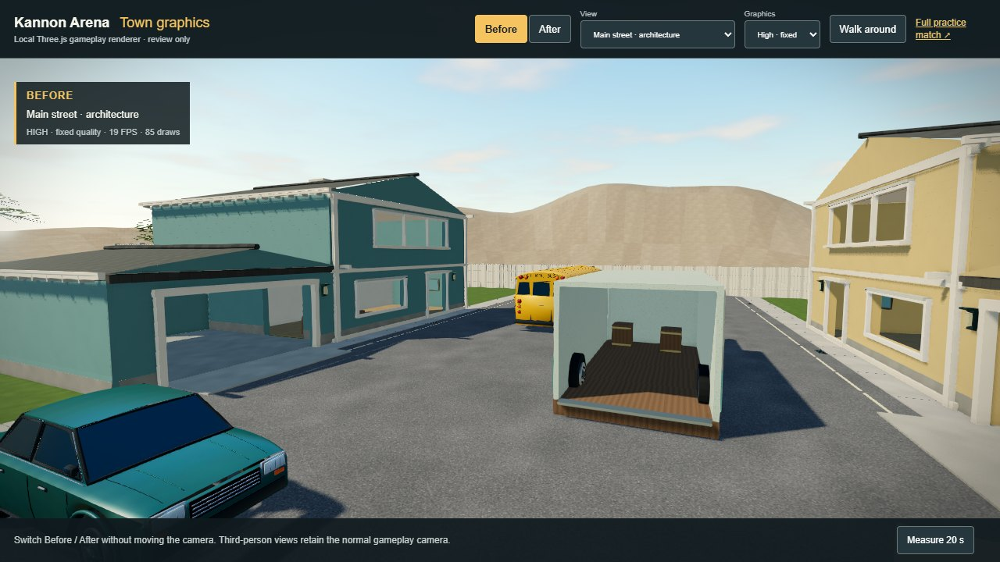
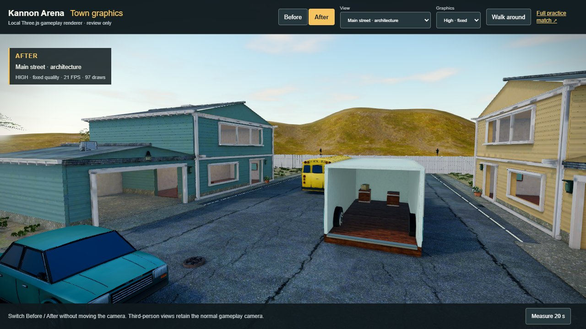
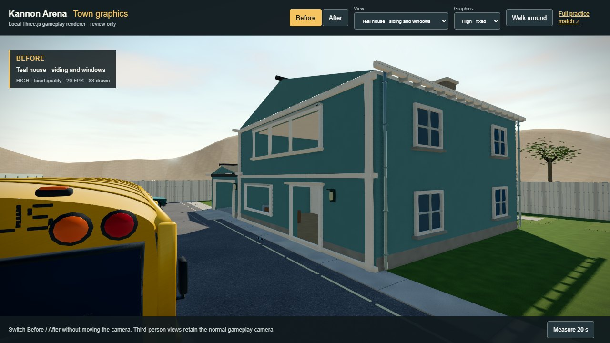
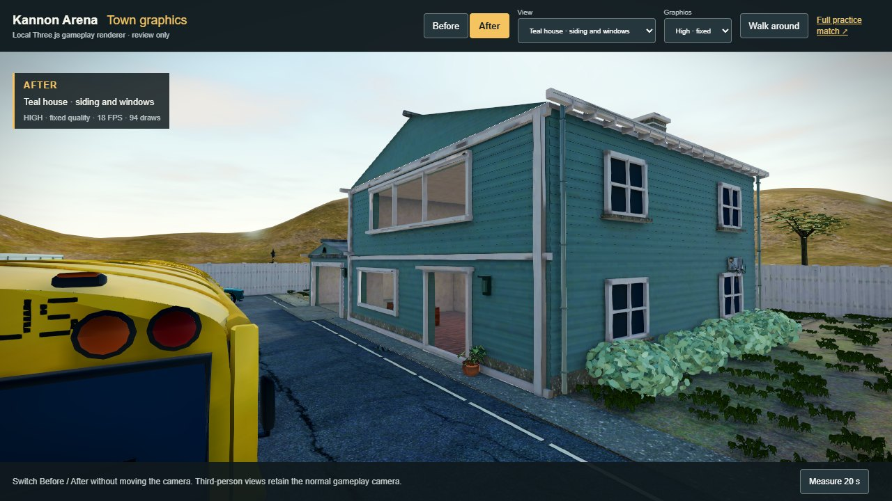
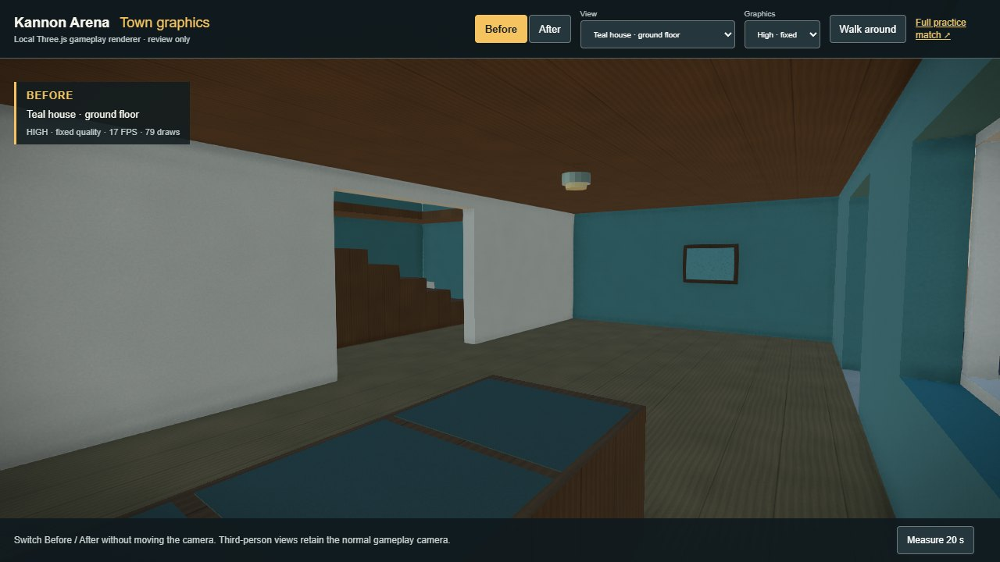
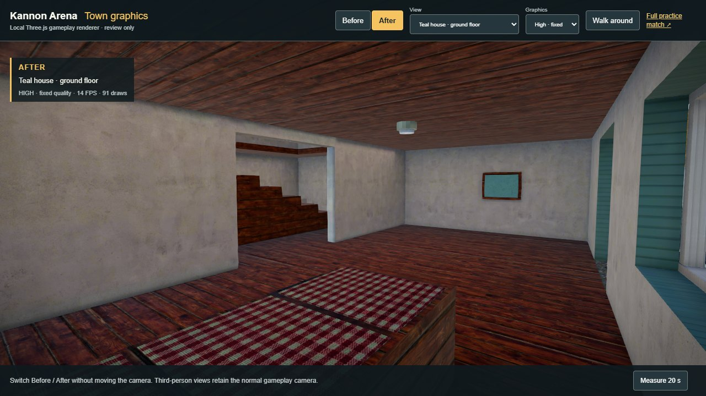
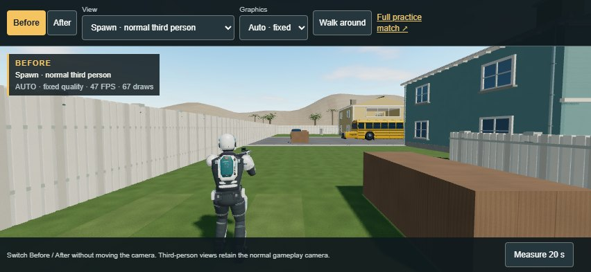
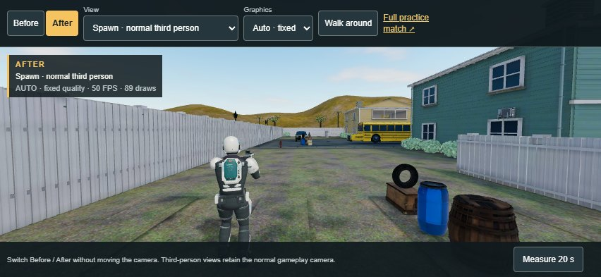
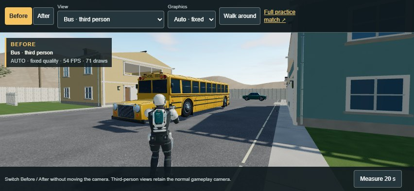
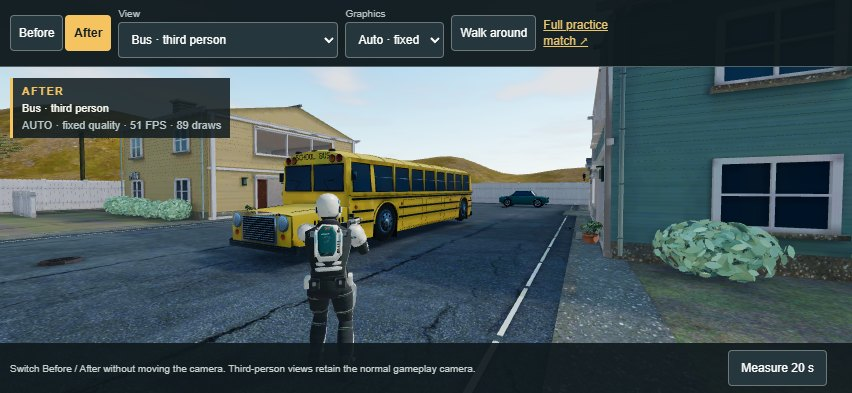

# Kannon Town v2 — textures, props and baked light, September 10, 2026

Frank asked for the visual quality to move toward Call of Duty Mobile without leaving the browser. The [design](superpowers/specs/2026-09-09-kannon-town-visual-overhaul-design.md) chose to stay on Three.js, buy or source real assets, keep the stylised-realistic look, put phones first, hold the first download near 40 MB, and re-skin the existing scout. Purchases need Frank's card, so this release uses CC0 assets throughout; a paid kit can replace pieces later (see [art/PURCHASED_ASSETS.md](../art/PURCHASED_ASSETS.md)).

The town layout, all 150 collision boxes, spawns, stair routes, weapons, scoring, networking and storage are unchanged. This is a visual release on the same game.

## What changed

- **Real surfaces.** Every grey procedural material is replaced by a Poly Haven CC0 texture set (colour, normal, roughness/metal/occlusion) tiled at metre scale: cracked asphalt, clean concrete, dark shingles, leafy lawn, painted planks tinted per house for siding and trim, painted plaster indoors, warm deck planks for floors, grassy rock for the horizon hills, bark for the trunks, a patterned fabric for the sofa.
- **Interiors.** Faces of the house walls and ceilings that look into a room are split off to plaster. Trunks split from the wood family to bark. Fences use white planks.
- **Props.** Twenty-six Poly Haven models, decimated to game budgets: barrels, crates, cardboard, a tyre stack and a parcel pile fill the existing cover boxes; wall-mounted air conditioners, security lights, a hose reel and a ladder hang on the houses; street lamps and a hydrant stand beyond the fences; a picnic table and a patio set sit under the balconies; generators, propane, bins, a utility box, a bench and a hand truck gather around the sheds. Bushes are built from leaf clusters, and grass tufts scatter over the lawns.
- **Baked lighting.** Sun, sky, bounce and warm fill lights inside the rooms are baked into four lightmap atlases (architecture 4096, ground and props 2048, foliage 512). Walls carry the roof and window shadows, the lawn carries the house shadows, and rooms are bright enough to fight in.
- **Compressed assets.** All 140 textures are KTX2 (Basis Universal), so they stay compressed on the GPU. Two builds ship from one scene: full (about 25.5 MB) and phone (about 12.4 MB, half-size textures).
- **Scout re-skin.** The scout's 1024 × 512 surface atlas is regenerated at 2048 × 1024 with edge wear, scratches, weave, brushed metal and bronze patina; rig, geometry and all eight clips are byte-identical, and the file shrinks to 2.1 MB through KTX2.
- **Desktop presentation.** Contact shading, bloom above a high threshold, a colour grade with a soft vignette, and SMAA edges. Phones never download this module.
- **Render tiers.** One table decides shadows, grass density, texture build and effects per device; every tier now draws a character shadow that follows the player.

## Play and compare

The normal game uses the new town and scout. [Play Kannon Arena](https://kpop.8westventures.com). The live `/health` revision and the release pull request identify the exact deployed source.

For the local comparison run `npm ci`, `npm run town-v2:fetch` once (downloads the CC0 sources into `C:\it\kannon-assets`), then `npm run graphics-test` and open **http://127.0.0.1:5184/graphics-test.html?graphics=v2**. Before is the previous refined town, After is v2, at identical cameras; add `&tier=phone` to compare the phone build. **Walk around** uses the real renderer, input and shared collision.

## Actual Three.js captures

These are GameView captures from the installed Edge on the machine's AMD integrated GPU, not Blender renders. Both sides use this release's runtime and lighting code; the Before side is the previous environment file.

| View | Before | After |
| --- | --- | --- |
| Main street, desktop High |  |  |
| Teal house front, desktop High |  |  |
| Teal house ground floor, desktop High |  |  |
| Spawn, third person, phone tier |  |  |
| Bus, third person, phone tier |  |  |

Every capture, with its camera and canvas, is listed in [town-v2-captures.json](verification/town-v2-captures.json).

## Measured cost

| Model download | Previous release | Kannon Town v2 |
| --- | ---: | ---: |
| Environment, full build, bytes | 7,884,316 | 25,468,864 |
| Environment, phone build, bytes | 7,884,316 (same file) | 12,399,132 |
| Environment triangles | 155,724 | 367,921 |
| Material primitives (draw calls) | 33 | 73 |
| Embedded images | 41 JPEG/PNG | 140 KTX2 |
| Scout, bytes | 2,679,764 | 2,143,776 |
| First-load models, full / phone | 10,564,080 | 27,612,640 / 14,542,908 |

Full-build SHA-256 `9fc222fd701fdafceff6dee2bd6713e21fc71eccf354a796c64ef1c06f41ea16`, phone build `7614ac6626de831cbba2cd6af58952c42d2ec59426026948c53445df2f42c263`, scout `3b282fde3843d7e0a7c14c708c16706ed833299bc35699d7fd9867f2107d15f9`. Both environment builds come from one export; the phone build halves every texture (lightmaps 2048/1024, colour 1024, detail 512, props 256).

Fixed bus gameplay view, one scout, Edge 152.0.4191.66, AMD Radeon integrated graphics through ANGLE/Direct3D 11. Twenty-second samples after a seven-second warm-up, adaptation locked, previous town measured before and after v2 in the same page. Desktop High is 1280×720 with the desktop presentation stack; the phone tier is 852×393 touch emulation on Automatic with the phone build, no post-processing and a 1024 shadow map. Values are previous / v2.

| Configuration | FPS | 95th-percentile frame ms | Median GPU ms | Draws | Triangles drawn |
| --- | ---: | ---: | ---: | ---: | ---: |
| Desktop High, first bracket | 24.8 / 22.7 | 66.7 / 66.8 | 27.9 / 30.2 | 98 / 112 | 295,980 / 395,656 |
| Desktop High, repeat bracket | 21.9 / 22.7 | 66.8 / 66.8 | 31.9 / 30.2 | 98 / 112 | 295,980 / 395,656 |
| Phone tier, first bracket | 59.9 / 54.5 | 16.8 / 33.4 | 4.1 / 5.9 | 71 / 89 | 290,070 / 384,722 |
| Phone tier, repeat bracket | 59.9 / 54.5 | 16.8 / 33.4 | 4.1 / 5.9 | 71 / 89 | 290,070 / 384,722 |

On this integrated GPU the phone tier keeps its 60 Hz median with about 1.8 ms more GPU time per frame; 5.9% of v2 frames exceeded 33 ms against 0% for the previous town, so the 95th percentile is one dropped frame rather than the previous flat 16.8 ms. Desktop High is dominated by the presentation stack on this GPU for both towns. Glass and film materials that arrived with glTF transmission were stripped: with them, three.js redrew the whole scene into a transmission buffer and the phone tier fell to 20 FPS. The raw report is [town-v2-performance.json](verification/town-v2-performance.json). **Phone means desktop Chromium touch emulation at DPR 1, not a physical iPhone.**

## Verification

- `npm run town-v2:validate` decodes both shipped files and proves: every non-vehicle collision box still has a visible witness face within a millimetre (861 faces), the three cover boxes that swapped their wood block for props are visibly filled from every side and the top, the eight doors and windows and the truck entrance stay open, every lightmapped material references a KTX2 atlas on the second UV set within the atlas, every image is KTX2 within the tier's size limit, props standing in walkable space are on the documented allowance, and bytes, triangles, and draw calls stay within budget.
- `node scripts/blender/validate_glb.mjs --glb public/models/scout-v2.glb` runs the full scout structure, attachment, muzzle and additive-clip checks plus the locomotion contact validation against the new file; both scouts pass and write their own review files.
- All existing rule, client and transport tests plus the new lightmap, sun-visibility, render-tier and extension tests pass (202 tests), with TypeScript, the production build and the asset checks.
- Physical iPhone rendering, gyro feel and a two-household match remain separate acceptance gates and were not run in this release.

## Editable sources and provenance

Use Blender **5.2.1 LTS**, Node.js 24+, KTX-Software 4.4 (`ktx` on PATH or `KTX_BIN`), and Python 3 with numpy and Pillow, from the repository root:

```powershell
npm run town-v2:fetch     # CC0 downloads into C:\it\kannon-assets, recorded in art/source/town-v2/cc0-manifest.json
npm run town-v2           # prepare, lightmap UVs, bake, export, KTX2 finish for both tiers, validate
npm run scout-v2          # regenerate the scout atlas, swap it into scout-v2.glb, validate
npm run town-v2:preview   # Cycles previews of the prepared scene
```

`scripts/blender/generate_town_v2.py` opens the previous release's editable `kannon-town-graphics.blend`, so the town geometry itself is still the repository's own work. The working Blender file, raw export, lightmap atlases and previews are regenerated under `art/source/town-v2/` and ignored by git; the manifests, the lightmap sidecar and the shipped GLBs are committed. The bake is deterministic apart from Cycles sampling noise.

Third-party material: Poly Haven textures and models, CC0 1.0, listed with URL, resolution and download digest in `art/source/town-v2/cc0-manifest.json`. Grass cards, bushes, the scout atlas and every material graph are original. The vehicles, truck and architecture remain the repository's own work. The scout's CMU motion keeps its separate existing notice. Three.js, its Basis transcoder and Meshopt decoder are MIT-licensed; KTX-Software is Apache-2.0.

## Limitations

- Shadows on the world are baked, so a player never casts a shadow on a wall or another player; the shadow map only darkens the baked ground and floors within a box around the local player.
- Props have no collision by design. Small ones stand in walkable space (bins, a bench, a hose reel); the validator lists them.
- The scout is a re-skin. A new character model is a separate project.
- The horizon trees and hills are lit in real time and stay simple.
- Desktop High on the reviewed integrated GPU is slower than the previous release because the presentation stack now includes bloom, a grade and SMAA; Automatic adapts resolution, and dedicated GPUs are not the constraint.
